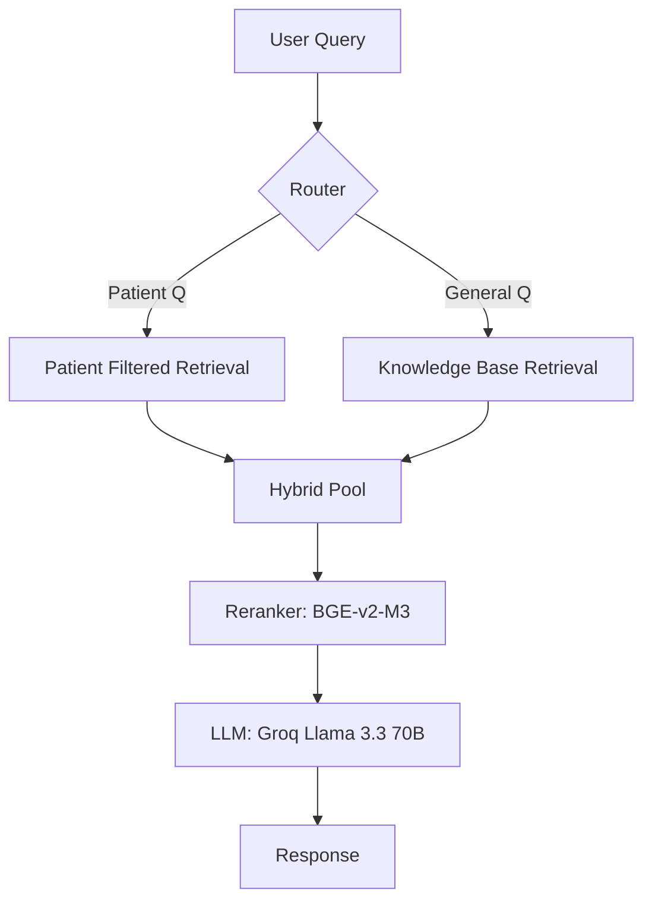

# RAG Health Agent - Architecture & Analysis

##  System Architecture

The RAG Health Agent follows a multi-stage retrieval-augmented generation pipeline optimized for medical precision and safety.

### Technical Stack Selection
| Component | Choice | Why this vs. Others? |
|-----------|--------|----------------------|
| **LLM** | **Groq (Llama 3.3)** | **Speed & Cost**. OpenAI GPT-4 is expensive and slow. Gemini hit strict rate limits (429s). Groq offers ~300 tokens/sec for free (beta). |
| **Vector DB** | **Pinecone (Serverless)** | **Scalability**. Local DBs (Chroma/FAISS) struggle with 10k+ users in memory. Pinecone handles millions of vectors serverlessly. |
| **Reranker** | **BGE-v2-M3** | **Precision**. Standard cosine similarity misses subtle medical context. Reranking the top 50 results yields state-of-the-art accuracy without training. |
| **Backend** | **FastAPI** | **Async Performance**. fast handling of concurrent RAG requests compared to Flask/Django. |

---

##  Key Features Implemented

1.  **Rich Medical History**: Ingested data from 7+ Synthea CSVs (Diagnoses, Medications, Allergies, Procedures, etc.)
2.  **Hybrid RAG**: Seamlessly queries **Specific Patient Data** OR **General Medical Knowledge** (Kaggle dataset).
3.  **10k Patient Scale**: Pipeline optimized with batching to handle 10,000+ records (1M+ vectors).
4.  **Premium UI**: Searchable sidebar, glassmorphism design, and PDF export.

---

##  Challenges Faced

### 1. API Rate Limits (The "429" Blocker)
*   **Issue**: Initial dev with Gemini 2.0 Flash hit quota limits instantly during multi-turn chats.
*   **Fix**: Migrated to **Groq**. Their LPU inference engine handles high throughput, and the `llama-3.3-70b` model offers GPT-4 class performance without the strict limits.

### 2. The "Lost in Middle" Phenomenon
*   **Issue**: With 100+ documents per patient (Labs, Notes, History), the LLM ignored key details in the middle of long contexts.
*   **Fix**: Implemented **Contextual Compression** (Reranking). We retrieve 50 docs but only feed the **Top 5** re-ranked chunks to the LLM.

### 3. Scaling to 10k Patients (Memory Crashes)
*   **Issue**: Attempting to load 10,000 Synthea CSVs into RAM crashed the ingestion script.
*   **Fix**: Refactored `ingestion.py` to use **Generator-based Batch Processing** (100 patients/batch), clearing memory after each upsert.

---

##  Potential Improvements

1.  **HyDE (Hypothetical Document Embeddings)**: Could improve retrieval for complex medical questions.
2.  **Knowledge Graph**: Augment RAG with a graph database (Neo4j) to track relationships between symptoms and medications.
3.  **Batch Processing**: Stream ingestion for millions of records using Spark or AWS Lambda.

---

##  Cons & Limitations

- **Latency**: Reranking adds ~500ms to the request.
- **Cost**: High-dimension embeddings and rerankers incur costs at scale.
- **Static Ingestion**: Data is not updated in real-time (requires periodic re-indexing).
- **Hallucination Risk**: Small but persistent in all LLMs; mitigated by strict "context-only" prompting.
