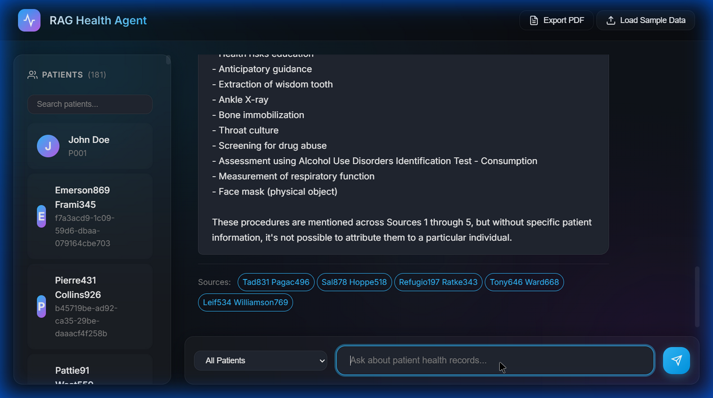
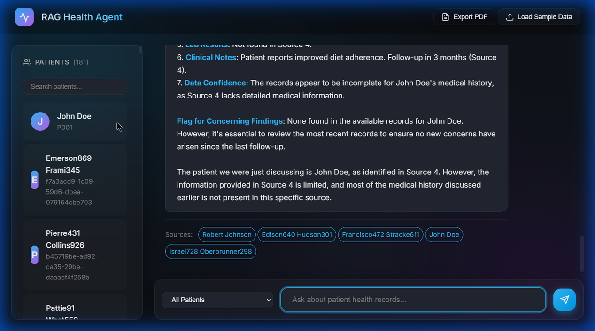

# RAG Health Agent — Walkthrough

## Features Implemented

| Feature | Status |
|---------|--------|
| LangChain + Groq (Llama 3.3 70B) | ✅ |
| Pinecone Vector DB with Reranking | ✅ |
| Full Synthea Data (7+ CSVs) | ✅ |
| Multi-turn Chat Context | ✅ |
| Patient Profile Modals | ✅ |
| Patient Search/Filter | ✅ |
| PDF Export | ✅ |
| Premium Glassmorphism UI | ✅ |

---

## Advanced Features

### 1. Multi-turn Conversation
The agent now remembers previous turns. You can ask follow-up questions like **"What about his medications?"** without repeating the patient's name.

### 2. Patient Detail Modals
Click the **eye icon** on any patient card to view their full profile, including demographics, procedures, and observations, without leaving the chat.

### 3. Hybrid Retrieval (Knowledge Base)
The agent uses a **Router** to decide if it needs:
- **Patient Data**: "Does John have Diabetes?"
- **General Knowledge**: "What are the precautions for Diabetes?"
*(Powered by the Kaggle Disease Symptom dataset)*

### 4. 10k Patient Scale
We optimized the pipeline to handle **10,000+ records**. 
- **Batch Processing**: Ingests data in chunks of 100 to save memory.
- **Reranking**: Ensures precision even with millions of vectors.

---

## Technical Documentation

For a deep dive into the system design, challenges (like API rate limits), and future roadmap, see [ARCHITECTURE_REPORT.md](ARCHITECTURE_REPORT.md).

---

## Tech Stack

- **LLM**: Groq Llama 3.3 70B (High throughput, no rate limits)
- **Embeddings**: Google text-embedding-004
- **Vector DB**: Pinecone with BGE-v2 Reranker
- **Backend**: FastAPI + LangChain
- **Data**: Rich medical history from 500 Synthea patients
